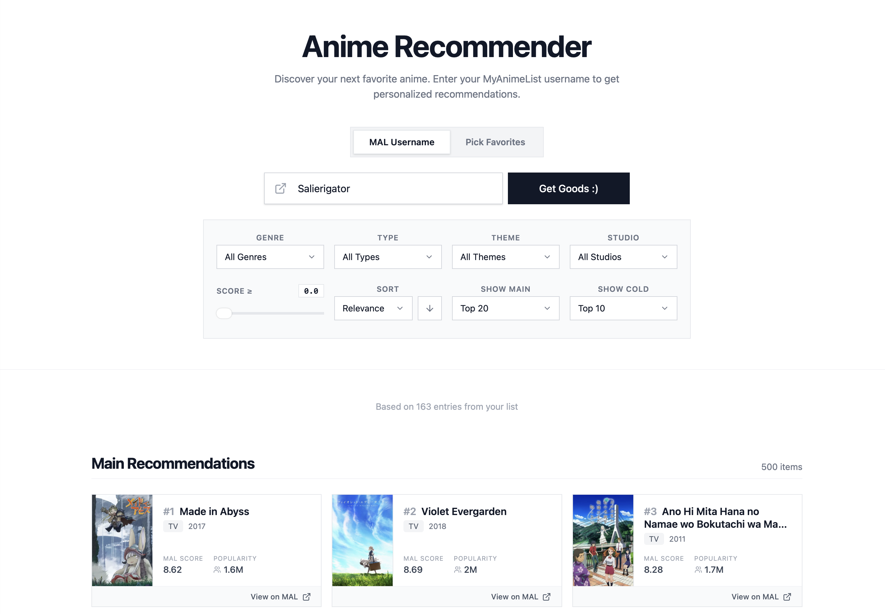

<p align="center">
  <a href="https://salierigator.github.io/anime-recommender/"></a>
</p>

A web app that turns your watch history (or a list of your favorite anime) into a personalized anime recommendation list.

**[▶ Try the live demo ◀](https://salierigator.github.io/anime-recommender/)** — enter your MyAnimeList username for a ranked list.

<sub><i>The backend is on a free tier, so the first request after it's been idle may take ~60s to wake up. Sorry about that.</i></sub> <sub>(,,¬﹏¬,,)</sub>

<p align="center">
  
</p>

---

## Architecture

Two-stage recommender architecture (retrieval + rerank) — the standard shape for recommenders that must score a large catalog under a latency budget:

1. **Retrieval** — a two-tower model embeds users and anime into one 128-d cosine space: cheap, recall-oriented.
2. **Ranking** — LightGBM (lambdarank) reranks the top 200 candidates on 29 features (user–item cosine, history affinity, genre/theme overlap, MAL metadata, …). Expensive per item, so it only ever sees the shortlist.
3. **Serving** — FastAPI backend + React frontend. Newly released titles the model never trained on (also called cold items) are served as a separate section ranked by cosine, never through the ranker — the ranker is trained on warm items and buries cold ones.

```
data/  ──>  model/      ──>  artifacts/    ──>  service/
raw         retriever        item_vectors       FastAPI + React
cleaned     + ranker         user_tower         (read-only consumer)
                             ranker.txt
```

`artifacts/` is the contract between training and serving: the retriever and ranker save their trained models here, and the service only reads them. Neither side imports the other's training code, so the serving path cannot silently drift from what was trained.

## Repository layout

| Path | What's in it |
|---|---|
| `data/` | Crawler (TODO), cleaning notebook, schema samples; raw/cleaned CSVs are not committed |
| `model/retriever/` | Two-tower model: data prep, training, export to `artifacts/` |
| `model/ranker/` | LightGBM reranker: pool building, training, eval gate, export to `artifacts/` |
| `artifacts/` | Model exports (not committed) |
| `service/backend/` | FastAPI app + CLI (`recommend.py`), read-only consumer of `artifacts/` |
| `service/frontend/` | React + Vite + TypeScript UI |
| `map/` | 2-D UMAP map of the catalog (TODO) |

## Quickstart (Local run)

**Prerequisites:** Python 3.9, Node.js 18+, and (optional, for looking up live MAL usernames) a [MyAnimeList API Client ID](https://myanimelist.net/apiconfig).

```bash
# 1. Clone the repo
git clone https://github.com/Salierigator/anime-recommender.git
cd anime-recommender

# 2. Create a virtual environment and install the Python dependencies
python3 -m venv venv
source venv/bin/activate           # Windows: venv\Scripts\activate
pip install -r requirements.txt

# 3. (Optional — real mode only) add your MAL Client ID
echo "MAL_CLIENT_ID=your_id_here" > service/.env
```

> **Note:** The run commands below need the trained model files in `artifacts/` — a download link will be added later. Mock mode runs without them.

```bash
# Backend, mock mode — returns fixtures, loads no model. Best for frontend work.
cd service/backend && MOCK_MODE=1 uvicorn app.main:app --reload --port 8000

# Backend, real mode — needs artifacts/; MAL_CLIENT_ID in service/.env for live usernames
cd service/backend && MOCK_MODE=0 uvicorn app.main:app --port 8000

# Frontend, run it in another terminal
cd service/frontend && npm install && npm run dev
# Open this link in your browser:  http://localhost:5173/

# CLI — no server; --mal-ids needs no MAL key
venv/bin/python service/backend/recommend.py --mal-ids service/backend/fixtures/dummy_mal_ids.txt
venv/bin/python service/backend/recommend.py <mal-username> --top-k 20
```

## Data & Training

The datasets are MAL-derived and gigabytes in size, so they are not part of this repo; `data/samples/` holds the first rows of each file as a schema reference. The model currently in `artifacts/` was trained on a mid-2025 snapshot — a fresh crawl is currently running (see [`data/crawler/README.md`](data/crawler/README.md)).

Retriever training runs on Colab GPU; the ranker trains locally on CPU. Both write into `artifacts/`, and the service picks up a new model with no code change — see [`model/README.md`](model/README.md) for the full retrain loop.

## History

This project grew out of my graduation thesis. The full thesis version (all experiments, baselines, ablations, docs) is frozen at tag [`thesis-final`](https://github.com/Salierigator/anime-recommender/tree/thesis-final).

I'd be glad if you find this project interesting, open for discussion anytime. Feel free to reach out:
- Email: hieulhp6@gmail.com
- Discord: salierigator
